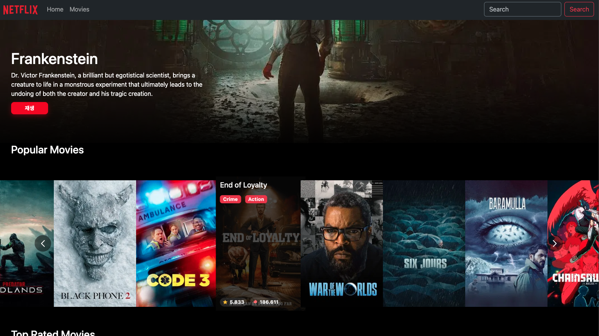
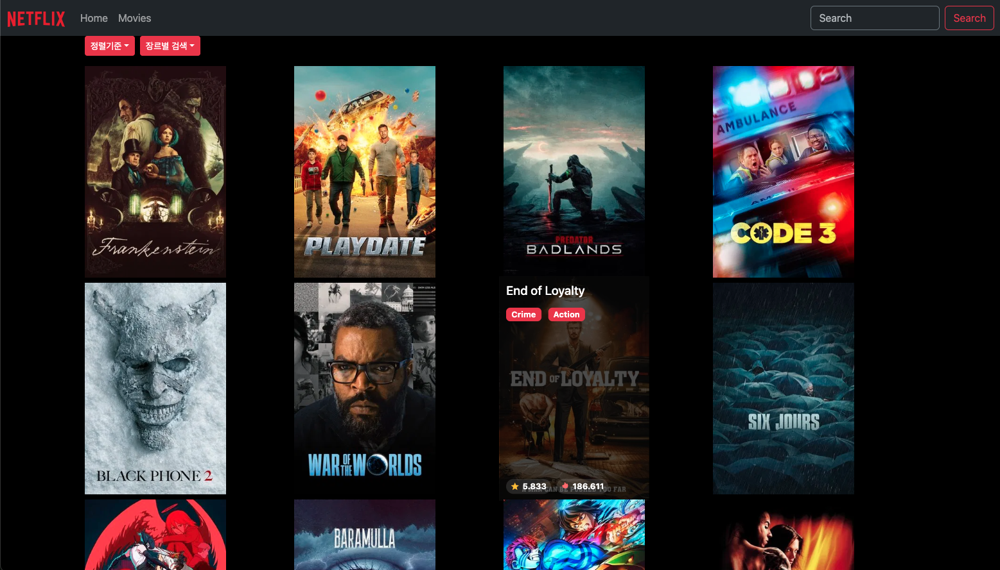
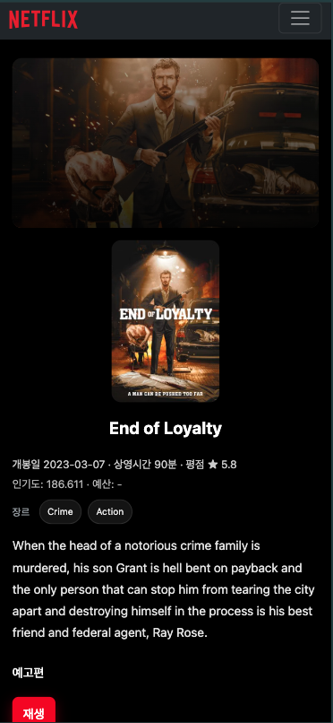

## React 
### 목표
- 포기하지 않고 끝까지 하는 것
- 넷플릭스 클론 코딩으로 react 공부
    - 공부 강의: 코알누 React 강의 및 스터디 참여
- 기초 react 실력 향상

### 스택
- vite
- React: 19.1.1
- React-dom
- React-router
- React-paginate
- React-Query
- axios: 1.13.2
- react-bootstrap: 2.10.10
- react-multi-carousel: 2.8.6

### 배포 
- Vercel
- URL: https://movie-react-demo-app.vercel.app/ 

### Demo

### 페이지 구성
- Home ('/')
- Movie List Page('/movies')
- Movie Detail Page ('/movies/:movie_id)

### 어려웠던 점 && 아쉬운 점
1. 문제
    - 상세 페이지 레이아웃을 어떻게 잡아야 할지 몰라 오래 막혔음.

2. 해결 방향
    - 화면을 몇 개의 블록(히어로, 포스터/정보, 트레일러, 리뷰) 나눔
    - 레이아웃 안(Flex vs Grid)을 비교
    - AI를 통해서 방향 검증 요청

3. 결과
    - 모바일, Web 모두에서 안정적인 레이아웃 형성
    - CLS(레이아웃 흔들림)와 가독성이 개선

4. 배운 점
    - 디자인 토큰으로 일관성 유지의 중요성

